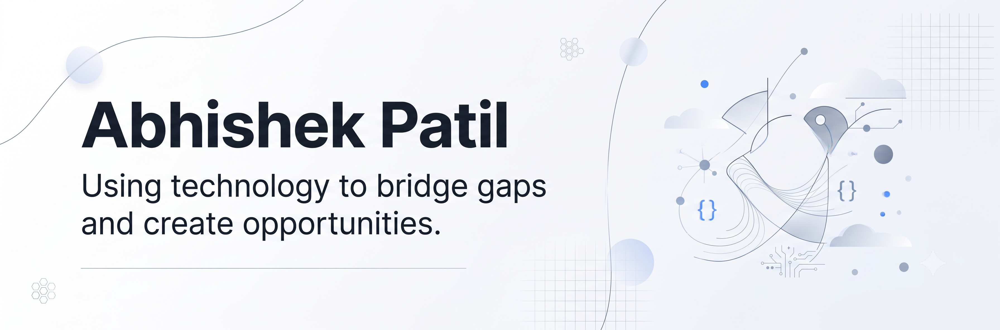

  

<h1 align="center">Hi 👋, I'm Abhishek Patil</h1>

  Software Engineering Student • Building AI Agents, Intelligent Systems & Practical Software Solutions

---

## 🚀 About Me

I'm a Computer Science student with a strong focus on **software engineering, applied AI, and intelligent systems**. My work spans full-stack development, machine learning, and — most recently — building agentic AI applications using frameworks like LangChain, LangGraph, and the Model Context Protocol (MCP).

- 🎓 Currently pursuing my degree, with coursework in **Generative AI & Applications**, **Robotics & Autonomous Systems**, and **Applied Physics**.
- 🌾 Built **Kagwad**, a full-stack platform connecting local businesses, farmers, and citizens — my first end-to-end product from concept to deployment.
- 🤖 Hands-on experience with **multi-agent systems, RAG pipelines, and ROS2-based robotics simulations**, developed through coursework and independent projects.
- 📚 Sharpening my problem-solving foundation through consistent practice in **Data Structures & Algorithms**.
- 🔍 Genuinely curious about how intelligent systems are designed, evaluated, and deployed — I enjoy going beyond the assignment to build things that actually work end-to-end.

---

## 🛠️ Tech Stack

### Languages

  

### Frontend

  

### Backend

  

### AI, Machine Learning & Agentic Systems

  
  
  
  
  
  
  

### Robotics

  
  

### DevOps & Tools

  

---

## 📊 GitHub Analytics

  

  

> 📌 Stats above are generated via a scheduled GitHub Action (see [`.github/workflows/user-statistician.yml`](.github/workflows/user-statistician.yml)) instead of the public `github-readme-stats` API, which fixes the intermittent loading failures caused by that service's rate limits.

---

## 📈 Contribution Graph

  

---

## 👾 Pac-Man Contribution Animation

  <picture>
    <source media="(prefers-color-scheme: dark)" srcset="https://raw.githubusercontent.com/AbhiPatil-02/AbhiPatil-02/output/pacman-contribution-graph-dark.svg">
    <source media="(prefers-color-scheme: light)" srcset="https://raw.githubusercontent.com/AbhiPatil-02/AbhiPatil-02/output/pacman-contribution-graph.svg">
    
  </picture>

> 📌 Generated daily via [`.github/workflows/pacman-contribution-graph.yml`](.github/workflows/pacman-contribution-graph.yml), which builds the SVG and publishes it to the `output` branch.

---

## 🌐 Connect With Me

  
  
  

---

  <i>"Building software with purpose, learning continuously, and turning ideas into impactful solutions."</i>

